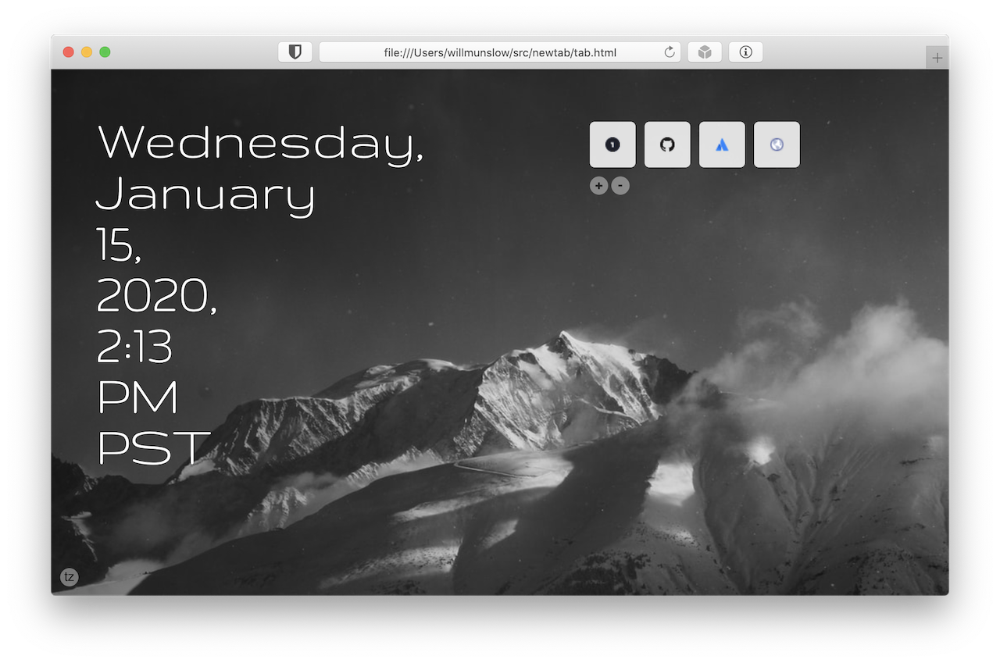

# newtab

Custom browser "new tab" page

Fetches a random nature photo from [Unsplash](https://unsplash.com/images/nature)

## Install

[Clone or Download](https://help.github.com/en/github/creating-cloning-and-archiving-repositories/cloning-a-repository) to a folder on your computer and update your browser settings. See below for an example in Safari.

## Useage

- Press `a` to add a link
- Press `d` to delete a link

## TODO

- set timezone

  For now, hack `time.js` with your [timezone](https://en.wikipedia.org/wiki/List_of_tz_database_time_zones).

## Install Example - Safari

